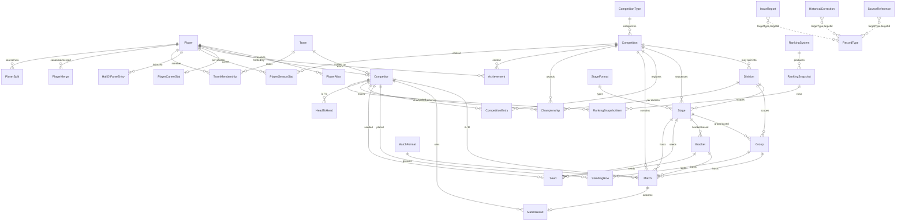

# WCC — Competition Data Model

Authoritative documentation for the WCC relational schema. It supports the legacy
**WCC** archive and all future WCC competitions (Seasons, Cups, Tournaments)
under one model. Implemented in [`prisma/schema.prisma`](./prisma/schema.prisma);
Payload-owned editorial content lives in `src/collections/`.

- **Prisma** owns the competition / records / identity core → PostgreSQL **`public`** schema.
- **Payload CMS** owns auth + editorial content → PostgreSQL **`payload`** schema.
- 32 Prisma models · 8 database CHECK constraints · 4 Payload collections.

> The schema was pressure-tested against ten operational workflows in
> **[WORKFLOW_VALIDATION.md](./WORKFLOW_VALIDATION.md)** and against the approved
> application policies in **[POLICY_FRAMEWORK.md](./POLICY_FRAMEWORK.md)**. The database
> stores facts, sources, and confidence; the application applies competition policy. The
> fields/enums added by those reviews (match resolution, byes, nullable scores, registration
> modes, entry method, seeding method + proposed seed, account linking, championship→match
> links, source claims, bracket feed links) are reflected below.

---

## 1. Ownership boundary (the key architectural decision)

Payload (via Drizzle) and Prisma both generate SQL. Letting two ORMs own the same
tables is a migration footgun. So each table has **exactly one owner**, and the two
live in **separate PostgreSQL schemas of the same database**:

```
                         one PostgreSQL database "ego"
   ┌───────────────────────────────┐   ┌───────────────────────────────┐
   │  schema: public  (Prisma)     │   │  schema: payload  (Payload)    │
   │  ───────────────────────────  │   │  ───────────────────────────   │
   │  competition graph, matches,  │   │  Users (auth + RBAC),          │
   │  results, standings, players, │   │  Media, News, Rules            │
   │  rankings, corrections,       │   │  (+ Payload versioning tables) │
   │  sources, issue reports       │   │                                │
   └───────────────────────────────┘   └───────────────────────────────┘
              ▲                                     ▲
              │  application-level IDs only         │
              └───────  (no cross-ORM FKs)  ────────┘
```

**Why this split.** Payload is unmatched for auth, RBAC, admin UX, and versioned
editorial content — so News, Rules, Users, Media are Payload collections. The
competition domain is a dense, FK-heavy relational graph (matches → players →
stages → competitions) whose integrity, indexing, and analytical querying are best
expressed as a first-class relational schema — so it is Prisma-owned. Keeping each
FK cluster within a single owner means every foreign key is real and enforced;
the only cross-layer links (e.g. a News post referencing a player, or a
`MatchResult.enteredByUserId` pointing at a Payload user) are plain ID fields
resolved in application code. `payload.config.ts` sets `schemaName: 'payload'`;
Prisma uses the default `public`. Neither introspects the other.

> **Admin surface (decided):** the Prisma-owned domain (players, competitions, matches,
> corrections, …) will be managed through a **custom authenticated admin section backed
> directly by Prisma**. Payload will **not** get mirror collections for these entities.
> Payload remains responsible for authentication, roles/permissions, Media, News, Rules,
> and editorial drafts/versioning; the custom admin authenticates against Payload users
> and enforces roles. (Admin UI is a later phase — not built here.)

---

## 2. Design principles & long-term scalability decisions

1. **One competition supertype.** Season / Cup / Tournament are **not** separate
   tables — they are `Competition` rows discriminated by a `CompetitionType`
   lookup. This is the "common underlying model" requirement; shared substructure
   (stages, groups, brackets, matches, standings) is written once and reused.

2. **Format is data, not schema.** The extensible dimensions — competition type,
   stage format, match format, ranking system — are **lookup tables**, not enums.
   Adding "Swiss with acceleration" or "Race to 9" or a new ranking algorithm is an
   `INSERT`, never a migration. Format-specific parameters ride in `Json` `config`
   columns. This is the core answer to *"support future formats without schema
   redesign."*

3. **Stages never assume a single format.** A `Competition` owns an **ordered set of
   `Stage`s**; each `Stage` points at a `StageFormat` whose `family`
   (`GROUP_BASED` / `BRACKET_BASED` / `SINGLE_MATCH` / `HYBRID`) tells the app
   whether to hang `Group`s, `Bracket`s, or a decider `Match` off it. A single
   competition can freely chain *groups → swiss → double-elim → finals* — any
   combination — because each stage is independent.

4. **Competitor supertype for future teams.** Every competitive reference (matches,
   standings, seeds, championships, rankings, head-to-head) points at a
   `Competitor`, which is a `Player` today and can be a `Team` tomorrow. Team
   support ships with **zero redesign** — no columns to add to Match/Standing/etc.

5. **Fixtures vs. outcomes are separate.** `Match` (the pairing/schedule) is split
   from `MatchResult` (the outcome). Upcoming events are matches without results;
   historical results carry their own provenance/confidence. Directly serves both
   "current & upcoming competitions" and the historical archive.

6. **Derived data is regenerated, never hand-edited.** `StandingRow`, `HeadToHead`,
   `PlayerSeasonStat`, `PlayerCareerStat`, and ranking snapshots are computed from
   primary match data. Corrections to a match propagate on recompute — the archive's
   numbers can never silently drift from its matches.

7. **Provenance on everything.** Every primary entity has a `Provenance`
   (`IMPORTED_WCC` | `NATIVE_EGO`) and a nullable `legacyId`/`legacy*Id`. Imported
   and native records are always distinguishable, and stable archive IDs (`P1316`,
   `2010-s1`) are preserved for traceability.

8. **Traceability is first-class.** `SourceReference` cites where any fact came from;
   `HistoricalCorrection` records before/after/why/who for changes to the
   Prisma-owned domain; `PlayerMerge` / `PlayerSplit` capture identity decisions;
   `IssueReport` captures public disputes. All four use a polymorphic
   `(targetType, targetId)` so they attach to *any* record.

9. **Confidence is modeled, not hidden.** `RecordConfidence`
   (`EXPLICIT` … `RECONSTRUCTED` … `UNKNOWN`) and `bracketReconstructed` carry the
   archive's honesty about what is verified vs. reconstructed, so the UI can say so.

10. **Indexing for a read-heavy public site.** Postgres does not auto-index foreign
    keys, so every FK used in a join/filter is explicitly indexed, plus composite
    indexes for common access paths (e.g. `Match(competitionId, round)`,
    `RankingSnapshotItem(snapshotId, rank)`). `Match` denormalizes `competitionId`
    and `divisionId` from its stage to keep the hottest queries single-index.

11. **CUID primary keys.** Stable, non-sequential string PKs are environment-portable
    (import/merge friendly) and uniform across the model. At WCC scale (~2k
    players, ~11k matches) this is comfortably efficient; high-volume tables can move
    to `bigint` later without touching relationships.

---

## 3. ER diagram



*(Polymorphic entities are shown against the `RecordType` discriminator; they carry
`targetType` + `targetId` rather than a hard FK — see §6.9.)*

---

## 4. Enums vs. lookup tables

**Lookup tables** (extend by inserting rows — the anti-redesign mechanism):
`CompetitionType`, `StageFormat`, `MatchFormat`, `RankingSystem`.

Recommended seed values (loaded in a later, explicit step — **not** seeded now):

| Lookup | Canonical starting rows |
|---|---|
| CompetitionType | `SEASON`, `CUP`, `TOURNAMENT` |
| StageFormat | `GROUP` · `ROUND_ROBIN` · `SWISS` (GROUP_BASED); `SINGLE_ELIM` · `DOUBLE_ELIM` (BRACKET_BASED); `FINALS` (SINGLE_MATCH) |
| MatchFormat | `RACE_TO_5`, `RACE_TO_7`, `RACE_TO_9`, `BEST_OF_5` … |
| RankingSystem | `ALL_TIME_WINS`, `SEASON_POINTS`, `ELO` … |

**Enums** (conceptually fixed): `Provenance`, `CompetitorType`, `AliasType`,
`CompetitionStatus`, `RegistrationMode` (`OPEN, APPROVAL_REQUIRED, INVITATIONAL,
QUALIFICATION_ONLY`), `EntryMethod`, `EntryStatus` (incl. `DECLINED`), `SeedingMethod`,
`StageFormatFamily`, `BracketType`, `MatchStatus` (lifecycle), `MatchResolution` (outcome
method), `MatchSlotSource` (bracket feed), `MatchFormatKind`, `RecordConfidence`,
`PlayerLinkStatus` (incl. `REJECTED`), `CorrectionStatus`, `ReviewStatus`, `IssueStatus`,
`SourceKind`, `RecordType` (incl. `HISTORICAL_CORRECTION`).

Note the deliberate split for matches: **`MatchStatus`** is the fixture *lifecycle*
(`SCHEDULED, IN_PROGRESS, COMPLETED, POSTPONED, CANCELLED, VOID`) while
**`MatchResolution`** on `MatchResult` records *how* a result was reached
(`PLAYED, WALKOVER, FORFEIT, DOUBLE_FORFEIT, BYE, RETIREMENT, ADMIN_DECISION`).

---

## 5. How the three competition types map onto the model

- **Season** (primary, recurring): `Competition(type=SEASON)` → optional `Division`s
  → a `Stage(GROUP)` with several `Group`s → a `Stage(DOUBLE_ELIM)` playoff with a
  `Bracket` → optional `Stage(FINALS)`. Mirrors the WCC season/division shape.
- **Cup** (secondary, flexible): e.g. `Competition(type=CUP)` → a single
  `Stage(SWISS)` → `Stage(SINGLE_ELIM)`. Different format, same tables.
- **Tournament** (one-off/invitational): e.g. `Competition(type=TOURNAMENT)` → one
  `Stage(SINGLE_ELIM)`. Or round-robin, or groups→bracket. Fully free-form.

No format is privileged; the stage sequence expresses the structure.

---

## 6. Entity reference

Legend: **PK** primary key · **FK** foreign keys · **IX** indexes · **CK** DB checks.
Every primary entity additionally has `provenance` and (where a stable archive ID
exists) a unique `legacyId`.

### 6.1 Identity & participants

#### Player
- **Purpose:** the canonical human competitor; the single identity aliases resolve to.
- **Relationships & why:** 1—1 `Competitor` (so competitive tables reference identity
  uniformly, team-ready); 1—* `PlayerAlias` (many historical handles → one person);
  1—1 `PlayerCareerStat`, 1—* `PlayerSeasonStat`/`Achievement`/`HallOfFameEntry`
  (records hang off identity); self-referenced by `PlayerMerge`/`PlayerSplit`.
- **PK:** `id` (cuid). **FK:** none. **IX:** `legacyPlayerId` (unique), `primaryName`,
  `provenance`, `linkedUserId`. **CK:** — **Account linking:** `linkedUserId` +
  `linkStatus` (`UNLINKED/PENDING/VERIFIED/REVOKED`) + `linkedAt` let a Payload user
  *claim* this identity **without owning it** — the Player stays canonical.
  **Extensibility:** identity signals (`primaryYm`, `primaryEmail`) support dedup.

#### PlayerAlias
- **Purpose:** a raw identifier (handle / YM / email / forum) a player used.
- **Relationships & why:** *—1 `Player` (`onDelete: Cascade`) — an alias is meaningless
  without its player.
- **PK:** `id`. **FK:** `playerId → Player`. **IX:** `alias`, `aliasType`, unique
  `(playerId, alias, aliasType)`. **CK:** — **Extensibility:** aliases are
  deliberately **not globally unique** — the same handle can map to different people
  over time (resolved via `PlayerSplit`). New alias kinds via `AliasType`.

#### Team *(future)*
- **Purpose:** a team identity, so team competitions need no redesign.
- **Relationships & why:** 1—1 `Competitor`; 1—* `TeamMembership`.
- **PK:** `id`. **FK:** none. **IX:** `legacyId` (unique), `name`. **Extensibility:**
  present but unused until team play begins.

#### TeamMembership *(future)*
- **Purpose:** player-in-team over time.
- **PK:** `id`. **FK:** `teamId → Team` (Cascade), `playerId → Player` (Cascade).
  **IX:** `teamId`, `playerId`, unique `(teamId, playerId, joinedAt)`.

#### Competitor
- **Purpose:** the **supertype** every competitive reference points at (Player now,
  Team later).
- **Relationships & why:** 0/1—1 to `Player` **or** `Team`; referenced by `Match`
  (A/B + winner), `StandingRow`, `Seed`, `CompetitionEntry`, `Championship`,
  `RankingSnapshotItem`, `HeadToHead`. Centralizing here is what makes the whole
  model team-ready without schema change.
- **PK:** `id`. **FK:** `playerId → Player` (unique), `teamId → Team` (unique).
  **IX:** `type`. **CK:** `competitor_exactly_one_identity` (exactly one of
  player/team), `competitor_type_matches_identity` (type agrees with which is set).

### 6.2 Competition structure

#### CompetitionType *(lookup)*
- **Purpose:** the category (SEASON/CUP/TOURNAMENT/…) as data.
- **PK:** `id`. **IX:** `code` (unique). 1—* `Competition`. **Extensibility:** new
  categories = new rows.

#### Competition
- **Purpose:** one competition instance (a season edition, a cup, a tournament).
- **Relationships & why:** *—1 `CompetitionType`; 1—* `Division`, `Stage`,
  `CompetitionEntry`, `Match`, `Championship`, `Achievement`, `PlayerSeasonStat`.
- **PK:** `id`. **FK:** `competitionTypeId`. **IX:** `legacyId`+`slug` (unique),
  `competitionTypeId`, `status`, `year`. **Registration (POLICY_FRAMEWORK.md §1):**
  `registrationMode` (`OPEN, APPROVAL_REQUIRED, INVITATIONAL, QUALIFICATION_ONLY`);
  auto-accept / capacity / deadline live in `metadata`.
  **Extensibility:** `metadata Json` for type-specific attributes without new columns;
  `rulesRef` links a Payload Rules doc.

#### Division
- **Purpose:** optional split within a competition (A/B), each with its own groups &
  playoff (WCC shape).
- **PK:** `id`. **FK:** `competitionId` (Cascade). **IX:** unique `(competitionId,
  code)`, `competitionId`. Referenced (nullable) by `Stage`, `Group`,
  `CompetitionEntry`, `Match`, `Championship`.

#### StageFormat *(lookup)*
- **Purpose:** a stage format + its structural `family`.
- **PK:** `id`. **IX:** `code` (unique). **Extensibility:** new formats = new rows;
  `configSchema Json` documents each format's expected `Stage.config`.

#### Stage
- **Purpose:** an ordered phase of a competition; the unit that lets a competition mix
  formats.
- **Relationships & why:** *—1 `Competition` (Cascade), optional *—1 `Division`,
  *—1 `StageFormat`; 1—* `Group`/`Bracket`/`Match`/`Seed` depending on format.
- **PK:** `id`. **FK:** `competitionId`, `divisionId?`, `stageFormatId`. **IX:**
  unique `(competitionId, sequence, divisionId)`, plus each FK. **Extensibility:**
  `config Json` for swiss rounds, tiebreakers, bracket size, etc.

#### Group
- **Purpose:** a group/pool within a group-based stage (round-robin & swiss included).
- **PK:** `id`. **FK:** `stageId` (Cascade), `divisionId?`. **IX:** `stageId`,
  `divisionId`. 1—* `StandingRow`, `Match`. Carries archive `scoreModel`.

#### Bracket
- **Purpose:** an elimination bracket; double-elim uses two (`WINNERS`+`LOSERS`).
- **PK:** `id`. **FK:** `stageId` (Cascade). **IX:** `stageId`. 1—* `Match`, `Seed`.
  `type` via `BracketType`.

#### Seed
- **Purpose:** a competitor's seeding into a stage/bracket.
- **PK:** `id`. **FK:** `stageId` (Cascade), `bracketId?`, `competitorId`. **IX:**
  unique `(stageId, competitorId)`, each FK. `handle` preserves an unresolved raw name.
  **Seeding policy (POLICY_FRAMEWORK.md §2):** `seedingMethod` (`MANUAL, RANDOM_DRAW,
  GLOBAL_RANKING, COMPETITION_STANDING, PREVIOUS_STAGE, PREVIOUS_SEASON, QUALIFICATION_ORDER,
  HYBRID, UNKNOWN`); `proposedSeedNo` preserves the originally calculated seed when `seedNo`
  is a manual override. Unknown historical seed = `UNKNOWN` method (never an invented number).

#### CompetitionEntry
- **Purpose:** a competitor's participation/registration (also powers live event
  registration).
- **PK:** `id`. **FK:** `competitionId` (Cascade), `divisionId?`, `competitorId`.
  **IX:** unique `(competitionId, competitorId, divisionId)`, `competitionId`,
  `competitorId`, `status`. `status` via `EntryStatus`; `entryMethod` via `EntryMethod`
  (public/admin-invite/admin-added/qualified/seeded); `statusReason` + `updatedAt`
  record why/when an entry changed (withdrawal, DQ).

### 6.3 Matches, results & format

#### MatchFormat *(lookup)*
- **Purpose:** the format + **race length** for matches.
- **PK:** `id`. **IX:** `code` (unique). **CK:** `raceLength > 0`. **Note on "Race
  Length":** modeled as the `raceLength` integer here rather than its own table — a
  race length is a simple attribute of a format; a separate table would add joins with
  no benefit. New formats = new rows.

#### Match
- **Purpose:** the central event — a contest between two competitors within a stage,
  optionally in a group or bracket.
- **Relationships & why:** *—1 `Competition`/`Stage` (Cascade), optional *—1
  `Division`/`Group`/`Bracket`/`MatchFormat`; two **optional** *—1 `Competitor` (A/B);
  1—0/1 `MatchResult`; 1—* `Championship` (as deciding match).
  `competitionId`/`divisionId` denormalized from stage for fast filters.
- **PK:** `id`. **FK:** as above. **IX:** `competitionId`, `stageId`, `groupId`,
  `bracketId`, `competitorAId`, `competitorBId`, `(competitionId, round)`, `status`.
  **CK:** `match_distinct_competitors` (A ≠ B when both set). **Byes / TBD:** competitor
  slots are **nullable** — a bye leaves one side null; an undetermined bracket fixture
  leaves both null. **Per-match alias:** `competitorAHandle`/`competitorBHandle` record
  the handle each competitor appeared under in this match. **Live-bracket feed
  (POLICY_FRAMEWORK.md §11):** `slotASourceMatchId`/`slotASource` (+ B) point a slot at the
  `WINNER`/`LOSER` of a prior match (self-FKs, indexed); a grand-final reset is a second
  finals match sourced from the first (WINNER + LOSER); static imported brackets leave these
  null. **Extensibility:** `round`/`roundName`/`matchNo`/`bracketType` describe any bracket
  shape without new tables.
- **CK:** `match_slot_source_not_self` (a match cannot be its own slot source).
- `status` is `MatchStatus` (lifecycle only).

#### MatchResult
- **Purpose:** the outcome, split from the fixture for scheduling + independent audit.
- **PK:** `id`. **FK:** `matchId` (unique, Cascade), `winnerCompetitorId?`. **IX:**
  `winnerCompetitorId`, `confidence`. **CK:** `match_result_nonnegative_scores`
  (passes on NULL). **Scores are nullable** — a known result with an *unknown* score
  (pair with `confidence = UNKNOWN`) is distinct from a real 0–0. `resolution`
  (`MatchResolution`) records how it was decided (played/forfeit/walkover/double-forfeit/
  bye/retirement/admin-decision). `enteredByUserId`/`verifiedByUserId` are app-level
  Payload user refs (no FK). `isDraw` supports non-decisive results.

### 6.4 Standings & head-to-head *(derived)*

#### StandingRow
- **Purpose:** a competitor's line in a group's table; regenerated from matches.
- **PK:** `id`. **FK:** `groupId` (Cascade), `competitorId`. **IX:** unique
  `(groupId, competitorId)`, `groupId`, `competitorId`.

#### HeadToHead
- **Purpose:** pairwise all-time record; one row per unordered pair.
- **PK:** `id`. **FK:** `competitorLoId`, `competitorHiId`. **IX:** unique
  `(competitorLoId, competitorHiId)`, each FK. **CK:** `h2h_canonical_ordering`
  (`lo < hi`) guarantees a single row per pair.

### 6.5 Records, accomplishments, rankings

#### Championship
- **Purpose:** a competition/division title (champion + runner-up) with confidence.
- **PK:** `id`. **FK:** `competitionId` (Cascade), `divisionId?`, `stageId?`,
  `decidedByMatchId?`, `championCompetitorId?`, `runnerUpCompetitorId?`. **IX:**
  `competitionId`, `championCompetitorId`, `stageId`, `decidedByMatchId`. `stageId` +
  `decidedByMatchId` trace the title to the stage/match that decided it. Carries
  `confidence` + `bracketReconstructed` (inferred/reconstructed champions).

#### Achievement
- **Purpose:** a coded accomplishment on a player, optionally competition-scoped.
- **PK:** `id`. **FK:** `playerId` (Cascade), `competitionId?`. **IX:** `playerId`,
  `code`.

#### RankingSystem *(lookup)* / RankingSnapshot / RankingSnapshotItem
- **Purpose:** a ranking methodology, a point-in-time table under it, and its rows.
- **Relationships & why:** `RankingSystem` 1—* `RankingSnapshot` 1—* `RankingSnapshotItem`
  → `Competitor`. Snapshots make rankings historical and reproducible.
- **Snapshot IX:** `rankingSystemId`, `asOf`. **Item PK/FK/IX:** `id`;
  `snapshotId` (Cascade), `competitorId`; unique `(snapshotId, competitorId)`,
  `(snapshotId, rank)`, `competitorId`. **Extensibility:** `config`/`detail Json`.

#### HallOfFameEntry
- **Purpose:** a curated induction or an all-time leaderboard row for a player.
- **PK:** `id`. **FK:** `playerId` (Cascade). **IX:** `playerId`, `category`.

### 6.6 Per-player aggregates *(derived)*

#### PlayerSeasonStat
- **Purpose:** per-competition stat line; recomputed.
- **PK:** `id`. **FK:** `playerId` (Cascade), `competitionId` (Cascade). **IX:**
  unique `(playerId, competitionId, divisionCode)`, `playerId`, `competitionId`.

#### PlayerCareerStat
- **Purpose:** whole-career aggregate, one row per player; recomputed.
- **PK:** `id`. **FK:** `playerId` (unique, Cascade). **IX:** `playerId` unique.

### 6.7 Identity corrections *(traceable)*

#### PlayerMerge
- **Purpose:** record that two canonical players are the same person.
- **PK:** `id`. **FK:** `canonicalPlayerId`, `mergedPlayerId` (both → Player, named
  relations). **IX:** unique `(canonicalPlayerId, mergedPlayerId)`, each FK. **CK:**
  `merge_distinct_players`. Carries `note` + reviewer + `status`.

#### PlayerSplit
- **Purpose:** record that a shared identifier was actually two people; carve out a new
  player (optionally scoped to a competition/division).
- **PK:** `id`. **FK:** `sourcePlayerId`, `newPlayerId` (both → Player). **IX:**
  each FK. **CK:** `split_distinct_players`.

### 6.8 Provenance, corrections & disputes *(cross-cutting, polymorphic)*

All three attach to **any** record via `(targetType: RecordType, targetId: String)`.
Relational DBs can't FK to "any table", so integrity is enforced in the app/import
layer; the pair is indexed for lookup. New target kinds = a new `RecordType` value.

#### SourceReference
- **Purpose:** cite where a fact came from (`playoffs.csv:88`, a Wayback URL, a review).
- **PK:** `id`. **IX:** `(targetType, targetId)`, `(targetType, targetId, field)`, `kind`.
  `kind` via `SourceKind`. **Conflicts:** optional `field` + `assertedValue` let a source
  state *what it claims*; two sources with different `assertedValue` for the same
  `(target, field)` = a detectable conflict, resolved via a `HistoricalCorrection`.

#### HistoricalCorrection
- **Purpose:** before/after/why/who for a change to the Prisma-owned domain (Payload
  versioning already covers Payload content). `field` + `beforeValue`/`afterValue Json`.
- **PK:** `id`. **IX:** `(targetType, targetId)`, `status`. `status` via `CorrectionStatus`.

#### IssueReport
- **Purpose:** the public issue-reporting system for disputed/incorrect data.
- **PK:** `id`. **IX:** `(targetType, targetId)`, `status`. Nullable `reportedByUserId`
  allows anonymous submissions; `status` via `IssueStatus`.

### 6.9 Payload-owned collections (schema `payload`)

| Collection | Purpose | Notes |
|---|---|---|
| **Users** | Admin/auth identities + RBAC (`roles`: admin/editor/member) | Payload auth |
| **Media** | Uploads | Payload upload |
| **News** | Announcements / articles | Drafts + versions (audit); app-level refs to Competition/Player |
| **Rules** | Rules & competition formats | Drafts + versions (audit); category + optional CompetitionType ref |

These reference the Prisma domain only by plain ID fields (e.g.
`relatedPlayerLegacyId`), never a cross-ORM FK.

---

## 7. Database constraints summary

Beyond PKs / FKs / uniques / not-nulls, these CHECK constraints are added in
[`prisma/migrations/*_constraints`](./prisma/migrations):

| Constraint | Table | Guarantee |
|---|---|---|
| `competitor_exactly_one_identity` | Competitor | exactly one of player/team set |
| `competitor_type_matches_identity` | Competitor | `type` agrees with which is set |
| `match_distinct_competitors` | Match | A ≠ B when both set (NULL slots allowed for byes/TBD) |
| `match_result_nonnegative_scores` | MatchResult | scores ≥ 0 when present (NULL = unknown) |
| `h2h_canonical_ordering` | HeadToHead | `lo < hi` (one row per pair) |
| `merge_distinct_players` | PlayerMerge | canonical ≠ merged |
| `split_distinct_players` | PlayerSplit | source ≠ new |
| `match_format_positive_race_length` | MatchFormat | raceLength > 0 |
| `match_slot_source_not_self` | Match | a match is not its own bracket-feed source |

---

## 8. Evolving the schema

- Edit `prisma/schema.prisma` → `npm run db:migrate` (creates + applies a migration).
- Constraints Prisma can't express → an empty migration (`--create-only`) with raw SQL,
  as done for the constraints migration.
- New **format / type / ranking** → insert a lookup row; **no migration**.
- Payload collection changes → editing `src/collections/*` (Payload manages the
  `payload` schema on run).
- Migrations live in `prisma/migrations/` and are committed. Local dev DB runs on
  pgserver port 54329 (see README).

**Not done here (by design):** no historical import, no seed data, no UI. The schema,
Prisma models, Payload collections, and this documentation are the deliverable.
