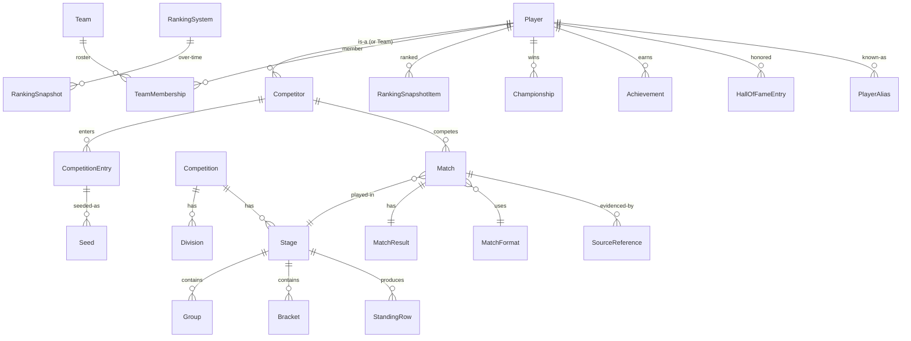
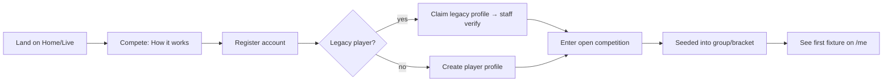
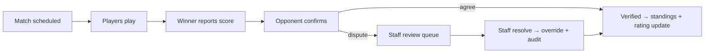

# 8 Ball Revival — Experience & Information Architecture Blueprint

> Status: **Proposal / build-from document.** No code changes implied. Infrastructure is frozen and stable (live deployment healthy). This blueprint defines the target UX before feature work resumes. Sections marked **[DECISION]** need your confirmation; everything else is a recommendation you can amend.

---

## 0. TL;DR — the five moves

1. **Unify the two domains into one competition graph.** Today's live `Season` and the historical `Competition`/records model are separate. Make the live season a *first-class Competition* so today's matches become tomorrow's history with zero migration. One `Player`, one `Match`, one ranking pipeline — forever.
2. **Player profile becomes the gravitational center.** Every match, standing, ranking, championship, and archive record links back to a canonical player page. This is what world-class competitive sites (Liquipedia, HLTV, Chess.com, start.gg) all get right.
3. **Navigation reorganized around four durable pillars** — *Compete, Standings, Players, Archive* — instead of the current season-launch-specific nav (Groups/Playoffs/Seasons).
4. **Every entity is addressable, linkable, and shareable** (stable slugs, breadcrumbs, OpenGraph cards, embeddable widgets). Cross-linking density is the difference between a "site" and a "world."
5. **Separate the three surfaces cleanly:** public experience, authenticated player experience, and staff/admin console — each with its own IA, not bolted onto one nav.

> **Archive taxonomy — LOCKED (final correction).** The competition archive has exactly two top-level sections: **Seasons** (standard group→playoffs league seasons only) and **Cups** (all variety competitions — prize, 2v2/doubles, invitationals, one-offs, special formats, elimination-only, other). Driven by `Competition.archiveCategory` (`season`\|`cup`) + a `format` subtype. No separate Tournaments/Doubles/Invitationals/Special-Events sections. Current official competition is **"8 Ball Revival Season 1"** (never "Season 2"); the 2026 archive heading is **"2026 Preseason"**. Build Seasons accurately first; scaffold Cups (routing/nav/model) but defer its full page. **Full spec in §5.5** — it governs §6 (sitemap), §7 (nav), and §12 (phasing).

---

## 1. Current-state analysis

### 1.1 What exists (as built)

**Public routes** (`src/app/(frontend)`): `/`, `/groups`, `/playoffs`, `/seasons` (+`/[slug]`), `/rules`, `/competitions` (+`/[slug]`), `/rankings`, `/players` (+`/[slug]`), `/hall-of-fame`, `/news` (+`/[slug]`), `/search`, `/account`, `/login`, `/register`.

**Internal routes** (`src/app/(internal)`): `/staff` + `/staff/{season,groups,matches,standings,playoffs,registrations,audit}`, `/archive-review`.

**Payload admin** (`src/app/(payload)`): `/admin`, `/api/*`, GraphQL.

**Navigation** (`src/lib/nav.ts`): Primary = Home, Groups, Playoffs, Seasons, Rules. Footer-only = Competitions, Rankings, Players, Hall of Fame, News.

**Data — records/archive domain (Prisma `public`):** `Player`, `PlayerAlias`, `Team`, `TeamMembership`, `Competitor`, `CompetitionType`, `Competition`, `Division`, `StageFormat`, `Stage`, `Group`, `Bracket`, `Seed`, `CompetitionEntry`, `MatchFormat`, `Match`, `MatchResult`, `StandingRow`, `HeadToHead`, `Championship`, `Achievement`, `RankingSystem`, `RankingSnapshot(+Item)`, `HallOfFameEntry`, `PlayerSeasonStat`, `PlayerCareerStat`, `PlayerMerge`, `PlayerSplit`, `SourceReference`, `HistoricalCorrection`, `IssueReport`. Rich provenance/identity model — clearly built to absorb the 2005–2014 8brcam archive with confidence scoring and merge/split resolution.

**Data — live-season domain (Prisma `public`):** `Season`, `Registration`, `SeasonGroup`, `GroupPlayer`, `SeasonMatch`, `PlayoffMatch`, `Standing`, `AuditLog`, with `LiveMatchStatus`/`VerificationState` enums.

**Content (Payload `payload`):** `Users`, `News`, `Rules`, `Media`.

### 1.2 Strengths to preserve

- The records domain is genuinely well-modeled: provenance, identity resolution, head-to-head, rankings snapshots, achievements. This is *rare* and valuable — most league sites can't tell you a player's 2009 record.
- Clean separation of public / internal / admin via route groups.
- Single source of truth for nav already abstracted.

### 1.3 Gaps & tensions (what the redesign must fix)

| # | Problem | Consequence |
|---|---------|-------------|
| G1 | **Two disjoint domains** (`Season*` live vs `Competition/Match` records). | Live results don't flow into history/rankings; duplicate concepts (`SeasonGroup` vs `Group`, `SeasonMatch` vs `Match`, `Standing` vs `StandingRow`). Every season ends in a manual migration or an archival dead-end. |
| G2 | **Nav is season-launch-shaped, not durable.** "Groups/Playoffs" are *stage types*, not top-level destinations. | Nav will churn every season; newcomers don't get a mental model of the site. |
| G3 | **Player profile is a footer afterthought.** | The most linkable, most-visited page type on every great competitive site is buried. |
| G4 | **No clear spectator/live surface.** `LiveMatchStatus` exists but there's no "what's happening now" destination. | The site feels like an archive, not a living league. |
| G5 | **Records surfaces (rankings, competitions, HoF) demoted to footer.** | The site's best asset (deep history) is hidden. |
| G6 | **No unified identity/onboarding story** linking a registered `User` (Payload) to a canonical `Player` (Prisma) to their archive history. | A returning 8brcam veteran can't "claim" their legacy profile. |

---

## 2. Vision & design principles

**North Star:** *The definitive home of competitive online 8-ball — where a match played tonight and a match played in 2007 live in the same world, and every player has one profile that tells their whole story.*

**Principles**

1. **One graph.** Everything is a node (player, competition, match, team) connected by typed edges. The UI is a set of views over that graph.
2. **Profiles over pages.** Optimize for entity pages (player, competition, match) that are deep, canonical, and cross-linked — not for flat marketing pages.
3. **Living + lasting.** Every screen answers both "what's happening now?" and "what's the record?" The transition from live → historical is invisible.
4. **Legible hierarchy.** A visitor should infer the whole site from the primary nav within 5 seconds.
5. **Progressive disclosure.** Casual fan sees clean summaries; the stats nerd can drill to frame-by-frame. Same page, deeper layers.
6. **Integrity is a feature.** Verification state, provenance, and dispute trails are shown, not hidden — trust is the moat for a rankings authority.
7. **Addressable & embeddable.** Stable slugs, OG cards, and embeddable widgets on every entity. The site should be quotable.
8. **Accessible & fast by default.** Keyboard-navigable, theme-aware, sub-second entity pages, works on a phone at a pool hall.

---

## 3. Strategic decisions to confirm **[DECISION]**

These shape the whole build. My recommended default is in **bold**; the blueprint assumes these unless you say otherwise.

> **Locked (per final correction):** the Seasons/Cups archive taxonomy is now **decided** — see §5.5. It confirms **D2** (doubles/2v2 exist, as a *Cup* `format`) and refines **D1** (the `format` subtype lives alongside `discipline`). D3–D6 remain open.

- **D1 — Game scope.** Single game (8-ball) forever, or a multi-discipline platform (9-ball, snooker, straight pool) later? → *Recommend: **8-ball-first, but keep a `discipline` dimension on Competition so expansion is additive, not a rewrite.***
- **D2 — Competitor unit.** Primarily **individual** players, with **teams as a secondary format** (the `Team`/`TeamMembership` models suggest you want both)? → *Recommend: **individual-first; model `Competitor` polymorphically (player or team) so team events slot in without new match plumbing.***
- **D3 — Live vs. reported.** Are matches played **live inside the site / with real-time score tracking**, or **reported after the fact** (results entered, then verified)? `LiveMatchStatus` hints at live. → *Recommend: **support both** — "report + verify" as the baseline, "live match room" as a progressive enhancement for featured matches.*
- **D4 — Archive prominence.** Is the 2005–2014 archive a **headline feature** (marketed heritage) or a **quiet backfill**? → *Recommend: **headline** — it's your unfair advantage; give it a top-level pillar.*
- **D5 — Ambition tier.** Community league, or aspiring competitive-esports platform (sponsors, prize pools, broadcast)? → *Recommend: **design the IA for the esports tier, build for the community tier** — the hierarchy below scales to both.*
- **D6 — Ranking authority.** One official rating system, or multiple (official + seasonal + peak)? `RankingSystem` is already plural. → *Recommend: **one canonical "8BR Rating" as the headline, with the system pluralized so you can add ELO/Glicko variants and per-season ladders.***

---

## 4. Audiences, personas & jobs-to-be-done

| Persona | Goal | Primary jobs | Key surfaces |
|---|---|---|---|
| **Fan / spectator** (unauth) | Follow the action & history | See what's live now; browse standings; look up a player; read news | Home, Live, Standings, Player profile, Competition hub |
| **Prospective player** | Join & compete | Understand format & rules; register; find their first match | Home, Rules, Compete/How-it-works, Register |
| **Registered competitor** | Play, track, climb | Report/confirm results; see my schedule; watch my rating; manage my profile | My Dashboard, My Matches, Player profile (own), Rankings |
| **Team captain** (if D2=teams) | Field a roster | Manage roster; register team; track team standings | Team profile, roster mgmt, Compete |
| **Historian / veteran** | Reclaim & explore legacy | Claim a legacy profile; correct records; explore 2005–2014 | Archive, Player profile, Corrections flow |
| **Staff / organizer** | Run the competition | Open registration, seed groups, verify results, resolve disputes, publish playoffs | Staff console |
| **Admin** | Own the platform | Content, users, roles, data integrity, config | Payload admin + Staff console |

---

## 5. Canonical domain model (the "one graph")

The core recommendation: **collapse the live-season models into the records models** so there is exactly one of each concept. Live and historical differ only by *state*, not by *table*.

### 5.1 Convergence map

| Live model (today) | Canonical target | Notes |
|---|---|---|
| `Season` | `Competition` (with `type = LEAGUE_SEASON`) | A season is just a recurring competition instance. |
| `SeasonGroup` | `Group` (under a `Stage` of family `ROUND_ROBIN`) | Reuse `StageFormat`. |
| `GroupPlayer` | `CompetitionEntry` + `Seed` | Entry = who's in; Seed = placement in a stage. |
| `SeasonMatch` / `PlayoffMatch` | `Match` (+ `MatchResult`) | One match table; `Stage`/`Bracket` differentiate group vs playoff. |
| `Standing` | `StandingRow` | Computed per stage; snapshot for history. |
| `Registration` | `CompetitionEntry` (status = PENDING/APPROVED…) | Registration is an entry lifecycle, not a separate noun. |

### 5.2 Entity glossary (canonical)

- **Player** — the person. Canonical identity; owns aliases, career/season stats, achievements, ranking history. Linked (optionally) to a Payload `User` account via a *claim*.
- **Competitor** — polymorphic wrapper: an entrant is *a Player* or *a Team* (enables team events without forking Match).
- **Team / TeamMembership** — roster over time (join/leave dates).
- **Competition** — a tournament/league/season instance. Has `discipline` (D1), `type` (league season, single-elim cup, ladder…), `status` (upcoming/live/completed/archived), dates.
- **Division** — optional skill/region split within a competition.
- **Stage** — an ordered phase (group stage, knockout, ladder). Has a **StageFormat** (round-robin, single/double elim, Swiss…).
- **Group / Bracket / Seed** — structures within a stage.
- **CompetitionEntry** — a competitor's participation (registration status, seed, withdrawal).
- **Match / MatchResult / MatchFormat** — one contest; format = race-to-N, handicap, etc.; result = score + verification.
- **StandingRow / HeadToHead** — computed tables.
- **RankingSystem / RankingSnapshot(+Item)** — the rating engine and its point-in-time leaderboards.
- **Championship / Achievement / HallOfFameEntry** — honors and milestones.
- **PlayerSeasonStat / PlayerCareerStat** — aggregates.
- **Identity & integrity:** `PlayerAlias`, `PlayerMerge`, `PlayerSplit`, `SourceReference`, `HistoricalCorrection`, `IssueReport` — keep as-is; they make the archive trustworthy.

### 5.3 The graph (relationships)



### 5.4 Account ↔ Player link (fixes G6)

- Payload `User` = credentials/session. Prisma `Player` = competitive identity.
- Introduce a **claim** relation: a `User` can *claim* a `Player` (including a legacy archive player), gated by staff verification. This lets a 2008 veteran log in and inherit their history — a signature moment.

### 5.5 Archive taxonomy — Seasons & Cups **[LOCKED — final]**

The competition archive has **exactly two top-level sections: Seasons and Cups.** Both are `Competition` records in the one graph (§5.1); a discriminator field decides which section a record belongs to. This is final — do not introduce other top-level competition sections.

**Two new fields on `Competition`:**

| Field | Values | Purpose |
|---|---|---|
| `archiveCategory` | `season` \| `cup` | **Single source of truth** for which section a competition appears in. |
| `format` (subtype) | `standard_season` \| `prize` \| `doubles` \| `invitational` \| `single_elimination` \| `special_event` \| `other` | Refines the competition within its section. |

**Seasons** — `archiveCategory = season`
- Contains **only standard league seasons** whose structure is **Group Stage → Playoffs** (`format = standard_season`).
- **Must exclude** every competition that does not follow that structure: prize tournaments, 2v2/doubles, invitationals, one-off events, special formats, elimination-only tournaments, and any other variety competition.
- Query: `WHERE archiveCategory = 'season'`.

**Cups** — `archiveCategory = cup`
- Contains **all variety competitions**: prize tournaments, 2v2/doubles, invitationals, one-off tournaments, special events, elimination-only competitions, and any other format that is not a standard group-stage-into-playoffs season.
- Within Cups, `format` (prize · doubles · invitational · single_elimination · special_event · other) drives **filtering inside the one section** — not separate top-level sections.
- Query: `WHERE archiveCategory = 'cup'`.

**Do NOT** create separate top-level sections called **Tournaments, Doubles, Invitationals, or Special Events.** All of those belong under **Cups**, differentiated by `format`.

**Invariant:** `format = standard_season` ⇒ `archiveCategory = season`; every other `format` ⇒ `archiveCategory = cup`. `archiveCategory` governs section membership; `format` refines within a section.

**Classification integrity (non-negotiable):** existing/historical competitions must be **classified accurately** into `season`/`cup` by setting `archiveCategory`/`format`. **Never delete, rename, or rewrite historical competition data** to fit the new structure. A record that doesn't fit gets the correct category/subtype — its history is not edited.

**Current season & 2026 naming:**
- The official current competition is **"8 Ball Revival Season 1"** — **never label it "Season 2."** (This supersedes the `nav.ts` "Season 2 launch" comment currently in code; that comment/label must be corrected when Seasons is implemented.)
- Inside Seasons, the 2026 archive heading remains **"2026 Preseason"** and contains **only qualifying standard (group→playoffs) seasons**.
- "8 Ball Revival Season 1" is the live/official season and is presented **separately** from the "2026 Preseason" archive grouping (it is not part of the preseason list).

**Routing & nav:** `/seasons` and `/cups` are the two top-level browse surfaces; detail pages (`/seasons/[slug]`, `/cups/[slug]`) render the shared Competition hub template, category-aware. Main nav eventually includes **both Seasons and Cups**.

**Build order for this taxonomy:** make the **Seasons** implementation accurate first (standard-season-only, correct 2026 Preseason / Season 1 handling). **Scaffold Cups** — the `archiveCategory`/`format` fields, the `/cups` route + nav entry, and category-filtered queries — so the architecture cleanly supports Cups. **Do not build the full Cups page yet** unless it is necessary to establish routing, navigation, or the data model.

---

## 6. Information architecture — sitemap & page hierarchy

### 6.1 Public pillars — Seasons & Cups anchor the archive (fixes G2/G3/G5)

Per §5.5, the competition archive is split into **Seasons** and **Cups**, and both sit in the primary nav. "Groups" and "Playoffs" are no longer top-level — they are tabs inside a season.

```mermaid
graph TD
    Home["🏠 Home / Live"]
    Seasons["🏆 Seasons"]
    Cups["🥉 Cups"]
    Standings["📊 Rankings & Standings"]
    Players["👤 Players & Teams"]
    Records["📚 Records & Heritage"]
    More["News · Rules · About · Register"]

    Home --> Live["Live now / featured matches"]
    Seasons --> S1["Current: 8 Ball Revival Season 1 (live, shown separately)"]
    Seasons --> Pre["Archive: 2026 Preseason + prior standard seasons"]
    Seasons --> SNote["standard_season only · archiveCategory=season"]
    Cups --> CupList["All variety competitions · archiveCategory=cup"]
    Cups --> CupFilter["Filter by format: prize · doubles/2v2 · invitational · single-elim · special · other"]
    Standings --> Rankings["8BR Rating leaderboard"]
    Standings --> Brackets["Standings & playoff brackets"]
    Players --> Directory["Player directory / search"]
    Players --> Profile["Player profile"]
    Players --> Teams["Teams (if enabled)"]
    Records --> Timeline["Era timeline 2005→now"]
    Records --> HoF["Hall of Fame"]
    Records --> Champions["Champions & titles"]
    Records --> H2H["Head-to-head explorer"]
```



### 6.2 Full sitemap

```
/                              Home — live now + spotlight + latest results + standings peek
/compete                       Compete hub — how it works, current + upcoming competitions, CTA to register
  /compete/register            Registration flow (auth-gated steps)
/seasons                       Seasons archive — standard group→playoffs league seasons ONLY (archiveCategory=season)
                               Current "8 Ball Revival Season 1" shown SEPARATELY from the "2026 Preseason" archive grouping
  /seasons/[slug]              Season hub (shared Competition template)
    …/standings                Group-stage standings / groups
    …/bracket                  Playoffs bracket
    …/schedule                 Fixtures & results
    …/entrants                 Field / seeds
/cups                          Cups archive — ALL variety competitions (archiveCategory=cup); filter by format
                               (prize · doubles/2v2 · invitational · single-elim · special · other). Scaffold first; full page deferred.
  /cups/[slug]                 Cup hub (shared Competition template)
/matches/[id]                  Match page (live or historical) — the atomic shareable unit
/live                          Live center — everything in-progress + recently finished
/rankings                     Leaderboard (system switcher, division/era filters)
  /rankings/[system]          A specific ranking system's ladder + methodology
/players                      Player & team directory + search
  /players/[slug]             Player profile (canonical) — the hub of the whole site
  /teams/[slug]               Team profile (if D2)
/archive                      Records home — era timeline, browse by year/competition
  /archive/champions          Roll of champions
  /archive/hall-of-fame       Hall of Fame
  /archive/head-to-head       H2H explorer
/news, /news/[slug]           Editorial
/rules                        Rules & formats (versioned)
/about                        The league, its history, contact
/search                       Global search (players, competitions, matches, news)

# Authenticated (player)
/me                           Dashboard — my next matches, my rating, my notifications
/me/matches                   Report/confirm results, history
/me/profile                   Edit public profile, claim legacy player, avatar
/me/settings                  Account, notifications, privacy
/login /register /account     Auth (keep; fold /account into /me)

# Staff / admin (separate console — section 6.3)
/staff/…                      Operations console
/admin                        Payload CMS (content, users, low-level data)
```

**Template reuse is deliberate:** `/seasons/[slug]` and `/cups/[slug]` render the *same* Competition hub component, discriminated by `archiveCategory` (fixes G1 at the UI layer). "Groups" and "Playoffs" become **tabs within a season**, not top-level nav (fixes G2) — while `/live` and `/rankings` give the "what's happening / who's best" answers that deserve top-level status. `/seasons` queries `archiveCategory='season'`; `/cups` queries `archiveCategory='cup'` (§5.5).

### 6.3 Staff/admin IA (separate surface)

```
/staff                    Console home — needs-attention queue (pending results, disputes, registrations)
  /staff/competitions     Create/configure competitions, stages, formats, seeding
  /staff/registrations    Approve/deny entries, manage waitlist
  /staff/results          Verify/override match results, resolve disputes
  /staff/brackets         Generate/seed/publish brackets
  /staff/rankings         Recompute/publish ranking snapshots
  /staff/archive-review   Provenance/merge/correction review (existing tool — keep)
  /staff/audit            Immutable audit log
/admin                    Payload — News, Rules, Media, Users, roles
```
Guiding rule: **staff tools mirror the public entity model** (a staff "competition" screen edits the same `Competition` a fan reads) so there's no third data model.

---

## 7. Navigation system

- **Global primary nav (persistent):** **Seasons · Cups · Rankings · Players** — plus a **Live** indicator (pulses when matches are in progress) and global **Search**. News/Rules/About/Register in an overflow ("More") to keep the bar to ~4–5 durable items. *Seasons* and *Cups* are the two competition-archive destinations (§5.5); *Register/Compete* is surfaced as a prominent CTA inside the current "8 Ball Revival Season 1" hub rather than as its own nav pillar. (Interim state: `nav.ts` today lists Groups/Playoffs/Seasons — these collapse into the Seasons hub as tabs; Cups is added when scaffolded.)
- **Utility nav (right):** theme toggle, Search, and auth state → Sign in / avatar menu (Dashboard, My matches, Profile, Sign out; Staff/Admin links appear here for privileged roles only).
- **Local/contextual nav:** tabs within entity hubs (Competition: Overview · Standings · Bracket · Schedule · Entrants; Player: Overview · Matches · Titles · Stats · History).
- **Breadcrumbs everywhere below top level:** `Archive › 2009 › Winter Cup › Final › J. Smith vs …` — makes the graph walkable and boosts SEO.
- **Cross-linking density:** every player name, competition name, and match score is a link. This is the single highest-leverage UX rule.
- **Footer:** full sitemap, secondary/legal, era quick-links, embed/API, social.
- **Mobile:** primary pillars in a sheet; a persistent bottom bar for Live · Standings · Search · Me; contextual tabs collapse to a scrollable segment control.
- **Search:** global, entity-typed (players / competitions / matches / news), keyboard-first (`/` to focus, ⌘K palette later). Player-name resolution must handle aliases (ties into `PlayerAlias`).

---

## 8. Key page blueprints

For each: **purpose · primary content · key components · states**.

### 8.1 Home / Live
- *Purpose:* answer "is this alive?" and route everyone in 1 screen.
- *Content:* live/featured matches strip; current season snapshot (top of standings + next fixtures); latest results; rating movers; latest news; heritage teaser ("Since 2005 · N matches on record").
- *States:* in-season (live-forward) vs off-season (spotlight last champion + archive + "next season opens…").

### 8.2 Player profile `/players/[slug]` — **the hub**
- *Purpose:* the canonical story of one competitor; most-linked page on the site.
- *Content:* identity header (name, aliases, avatar, current 8BR Rating + peak, region, "claimed" badge); at-a-glance (W-L, titles, current season); tabs: **Overview** (rating chart, recent form, honors), **Matches** (filterable, all-time incl. archive), **Titles/Achievements**, **Stats** (season & career), **Head-to-head**, **History/Timeline** (2005→now). Provenance shown for archive rows.
- *Components:* rating sparkline, form guide (WWLWL), honors shelf, H2H mini-widget, "claim this profile" CTA (for legacy, when unauth or unclaimed).
- *States:* active member · legacy/unclaimed · claimed-by-you (edit affordances).

### 8.3 Competition hub `/seasons/[slug]` and `/cups/[slug]`
- *Purpose:* one shared template, discriminated by `archiveCategory` (§5.5). Seasons show the standard group→playoffs shape; Cups adapt tabs to their `format`.
- *Content:* header (name, `format`, dates, status, champion if done); tabs — **Seasons:** Overview · Standings/Groups · Bracket · Schedule/Results · Entrants/Seeds. **Cups:** Overview · (Bracket *or* Standings depending on `format`) · Schedule/Results · Entrants. Registration CTA when open.
- *States:* upcoming (register) · live (highlight current round) · completed (crown champion) · archived.
- *Note:* the Seasons hub renders "8 Ball Revival Season 1" as the live season, distinct from the "2026 Preseason" archive list.

### 8.4 Match page `/matches/[id]`
- *Purpose:* the atomic shareable unit; great OG card.
- *Content:* competitors (linked), score, format (race-to-N), stage/round context, status/verification, timeline (frames/racks if tracked), evidence/source (archive), H2H context, "what this did to their rating."
- *States:* scheduled · live (auto-refresh) · reported (awaiting confirm) · verified · disputed.

### 8.5 Rankings `/rankings`
- *Purpose:* "who's best right now" + methodology trust.
- *Content:* leaderboard (rank, player, rating, Δ, form), system switcher (D6), filters (division/era/active-only), snapshot date selector (time-travel via `RankingSnapshot`), methodology link.

### 8.6 Standings / Groups & 8.7 Bracket
- Standings: sortable table per group/stage with tiebreak explanations; qualification cutlines visualized.
- Bracket: responsive single/double-elim; live results propagate; deep-linkable to a match; horizontal scroll container on mobile.

### 8.8 Archive home `/archive`
- *Purpose:* make heritage a destination (D4).
- *Content:* era timeline (2005→now) with era summaries; browse by year/competition; champions roll; Hall of Fame; H2H explorer; "biggest rivalries / longest streaks" editorial hooks.

### 8.9 Player dashboard `/me`
- *Content:* next matches + report/confirm actions; my rating + movement; registration status; notifications; quick links to my profile.

### 8.10 Staff console `/staff`
- *Content:* a **needs-attention queue** first (pending results, disputes, new registrations), then tools per section (6.3). Every action writes `AuditLog`.

---

## 9. Core user flows

### 9.1 Onboarding → first match


### 9.2 Play → report → verify (the integrity loop)


### 9.3 Spectate live
Home/Live → live match strip → Match page (auto-refresh) → jump to either Player profile or the Competition bracket.

### 9.4 Explore history / claim legacy
Archive → era/year → Competition hub → Match → Player profile → "Claim this profile" → verify → merge aliases (`PlayerMerge`).

### 9.5 Correction / dispute a record
Any archive entity → "Report an issue" (`IssueReport`) → staff `/staff/archive-review` → `HistoricalCorrection` with `SourceReference` → visible provenance trail.

### 9.6 Staff: run a season (end-to-end)
Create Competition → configure Stages/Formats → open registration → approve entries → seed groups → publish schedule → verify results as they arrive → generate & publish playoff bracket → crown champion → publish ranking snapshot → competition auto-flows into Archive.

---

## 10. Competitive-gaming feature system

- **Rating engine (8BR Rating):** one headline system (D6), pluggable (ELO/Glicko/Elo-with-handicap). Snapshots power time-travel leaderboards and profile rating charts. Show Δ everywhere.
- **Seasons cadence:** recurring `Competition` instances with a predictable calendar (registration → groups → playoffs → offseason). Off-season states keep the site alive (awards, retro, next-season countdown).
- **Formats/brackets:** `StageFormat` supports round-robin, single/double elim, Swiss, ladder. Adding a format = data, not new pages.
- **Live match room (D3, progressive):** rack-by-rack tracking, spectator view, auto-updating bracket/standings.
- **Honors:** `Championship`, `Achievement`, `HallOfFameEntry` surfaced on profiles and a dedicated archive area; achievement unlock moments drive engagement.
- **Head-to-head & rivalries:** `HeadToHead` powers profile widgets and editorial ("the rivalry" pages).
- **Stats depth:** season & career aggregates; progressive disclosure from summary → advanced.
- **Identity & integrity:** aliases, merges/splits, provenance, confidence — displayed as trust signals, not hidden plumbing.
- **Notifications:** "your result needs confirming," "you've been seeded," "rating updated," "next match scheduled."
- **Social/shareable:** per-entity OG cards, embeddable rating/bracket/H2H widgets, shareable match links.

---

## 11. Long-term scalability & extensibility

- **S1 — Domain convergence (foundational):** migrate live `Season*` onto `Competition/Match/StandingRow`. Everything else in this blueprint compounds off this. Do it first.
- **S2 — Polymorphic competitor (D2):** `Competitor` = Player | Team → team events, doubles, scotch-doubles with no Match rework.
- **S3 — Discipline dimension (D1):** a `discipline` field on Competition → 9-ball/snooker later as additive data + a filter, not a fork.
- **S4 — Roles & permissions:** formalize `visitor < player < captain < staff < admin` with capability checks; staff links appear by role; every mutation audited.
- **S5 — Real-time layer:** an event/subscription channel for live scores, bracket propagation, and dashboard notifications (introduce when D3 live is prioritized).
- **S6 — Public API & embeds:** read API + OG images + embeddable widgets; the archive becomes a citable authority (Liquipedia-style network effects).
- **S7 — Data volume:** the archive (thousands of players/matches) demands directory pagination, search indexing, denormalized aggregates (`PlayerCareerStat`), and snapshotting rather than live recompute. Design lists for 10k+ rows from day one.
- **S8 — Integrity at scale:** dispute/correction workflows, rate limits on self-reporting, verification states front-and-center.
- **S9 — SEO/shareability:** stable slugs, breadcrumbs, structured data (Event/SportsEvent/Person), sitemaps — entity pages are the growth engine.
- **S10 — i18n & accessibility:** copy externalized, theme-aware, keyboard/AT-tested; a global sport means non-English audiences later.
- **S11 — Content vs. data split:** keep editorial (News/Rules/About) in Payload; keep competitive facts in the graph; cross-link them (a News post references a Match/Player).

---

## 12. Suggested build phasing (how we build from this)

> Sequenced so each phase ships value and de-risks the next. Not a commitment — a proposed order.

- **Phase 0 — Foundations:** confirm §3 decisions; finalize canonical model & the account↔player claim; design system/tokens; nav shell (4 pillars + Live + Search).
- **Phase 1 — Profiles & the Seasons archive (read-path):** player profile hub, match page, directory + search. **Build `/seasons` accurately** — standard group→playoffs seasons only (`archiveCategory='season'`), current "8 Ball Revival Season 1" rendered *separately* from the "2026 Preseason" archive grouping, and the code's "Season 2" label corrected. **Scaffold Cups without building its full page:** add `archiveCategory`/`format` to `Competition`, classify existing records accurately (no history rewrites, §5.5), add the `/cups` route + nav entry + category-filtered query. *Ships the "world," Seasons-first.*
- **Phase 2 — Cups page + live competition on the unified model:** build out the full `/cups` UI (format filtering); registration → entries → groups → schedule → report/verify → standings; retire `Season*` duplication (S1).
- **Phase 3 — Rankings & honors:** 8BR Rating engine, leaderboard, snapshots, championships/HoF surfacing.
- **Phase 4 — Brackets & playoffs**, then **Phase 5 — Live match room + notifications** (D3), then **Phase 6 — API/embeds/i18n**.

---

## 13. Open questions

1. §3 decisions D1–D6.
2. Rating math: which algorithm, and does it account for race length / handicaps?
3. Registration model: open ladder (join anytime) vs. fixed seasonal windows vs. both?
4. How is a match *actually* played today — in-person reported, online client, or hybrid? (Sets D3 fidelity.)
5. Team play priority and format (fixed teams, doubles, scotch)?
6. Legacy claim policy: how do we verify a 2008 veteran is who they say?
7. Moderation ownership and SLAs for disputes/corrections at scale.
8. Monetization/sponsorship surfaces to reserve space for now (even if unused)?

---

*End of blueprint. Nothing here is code; it's the map. Once §3 is confirmed, Phase 0 turns this into a component inventory, data-model migration plan, and route spec.*
